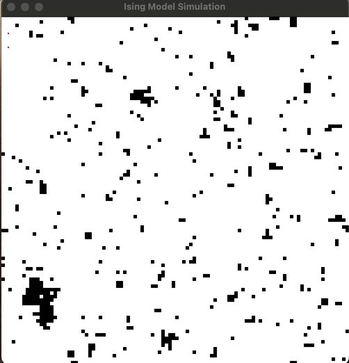
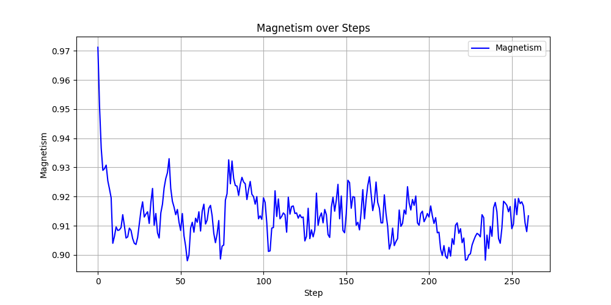

# Ising Model MCMC Simulation

This project implements a Markov Chain Monte Carlo (MCMC) simulation of the Ising model using C++ and SFML for visualization, and Python for data visualization. The Ising model is a mathematical model of ferromagnetism in statistical mechanics. This project represents one of my first coding endeavors and holds a special place in my journey as a programmer.



## Project Structure

IsingModel/
```
├── data/ # Directory for simulation output data
├── include/ # Header files for the project
│   ├── IsingModel.h # Header for the Ising model class
│   ├── MCMC.h # Header for the MCMC simulation class
│   └── DataOutput.h # Header for the data output class
├── src/ # Source files for the project
│   ├── IsingModel.cpp # Implementation of the Ising model class
│   ├── MCMC.cpp # Implementation of the MCMC simulation class
│   └── DataOutput.cpp # Implementation of the data output class
├── obj/ # Directory for compiled object files (generated automatically)
├── graphs/ # Directory for Python scripts and virtual environment
│   ├── plot_ising_model.py # Python script for plotting simulation data
│   ├── requirements.txt # Python dependencies
│   └── venv/ # Virtual environment directory (generated automatically)
├── main.cpp # Main file to run the simulation
├── arial.ttf # Font file for SFML text rendering
└── Makefile # Makefile for building the project
```

## About the Ising Model

The Ising model is a simple model of ferromagnetism that considers a lattice of spins, which can be in one of two states (+1 or -1). Spins interact with their neighbors, and the system evolves to minimize its energy. The MCMC method is used to simulate the thermal fluctuations of the spins at a given temperature.

## Personal Significance

This project is one of my first coding projects. It was challenging yet rewarding to implement the Ising model and visualize the results. It not only helped me understand the principles of statistical mechanics and thermodynamics but also significantly improved my programming skills, particularly in C++ and Python.

## Getting Started

### Prerequisites

- C++ compiler (e.g., `g++`)
- SFML library
- Python 3
- `virtualenv` for Python

### Installation

1. **Clone the repository**

   ```bash
   git clone <repository_url>
   cd IsingModel
   ```

2. **Ensure SFML is installed**

   If SFML is not installed, install it. For Homebrew users on macOS:

   ```bash
   brew install libsfml-dev
   brew install libsolv
   ```

3. **Compile and run the C++ simulation**

   Ensure the folder structure and Makefile are correctly set up, check if the SFML library is linked in the Makefile, and adjust the paths if necessary. You can do this by
   running the following command:

   ```bash
   brew info sfml
   ```

   Then compile and run the simulation:

   ```bash
   make
   ./ising_model
   ```

   This will generate `ising_data.csv` in the `data` directory.

4. **Set up the Python environment**

   Navigate to the python directory and create a virtual environment:

   ```bash
   cd graphs
   python3 -m venv venv
   source venv/bin/activate
   ```

5. **Install Python dependencies**

   Install dependencies from the `requirements.txt` file:

   ```bash
   pip install -r requirements.txt
   ```

6. **Run the Python script**

   After the C++ simulation has completed and `data/ising_data.csv` is generated, run the Python script to plot the data:

   ```bash
   python plot_ising_model.py
   ```

7. **Deactivate the virtual environment**

   Once done, you can deactivate the virtual environment:

   ```bash
   deactivate
   ```

## Viewing the Plots

The Python script will display the plots for magnetism and temperature over steps and save them as `magnetism_over_steps.png` and `temperature_over_steps.png` in the `graphs` directory.



## Conclusion

This project was a foundational experience in my coding journey, teaching me valuable lessons in both programming and scientific computing. I hope it serves as a useful reference for anyone interested in the Ising model or MCMC simulations.

## License

This project is licensed under the MIT License - see the LICENSE file for details.
